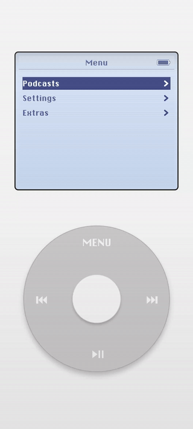
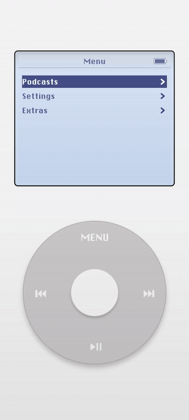

# Android Sleep Podcast

A Jetpack Compose demo application that recreates the tactile interaction model of the **iPod Classic (4th Generation)** while exploring modern Android architecture.

The project combines **gesture-driven UI**, **state machine navigation**, and **media playback** to recreate the experience of browsing and playing sleep podcast episodes using a virtual click wheel.

The goal of this project was not simply to build a podcast player, but to explore how classic hardware interaction models can be implemented using modern Android technologies such as **Jetpack Compose**, **Material 3**, and **reactive state management**.

---

# Demo

### Episode Download


### Playback Interaction


---

# Features

## iPod Classic 4th Generation Interaction Model

- Circular click-wheel gesture detection  
- Hardware-style button interactions and press states  
- Menu-driven navigation inspired by the classic iPod interface  

## State Machine Navigation

Navigation is driven by an explicit **menu state machine**, allowing:

- predictable transitions  
- testable UI behavior  
- separation between UI rendering and navigation logic  

## Podcast Playback

- Audio playback supported by **ExoPlayer**  
- Episode selection and playback controls  
- Lightweight playback interface designed around the click wheel interaction  

## Episode Downloads

- Download episodes for offline listening
- Simple local storage management
- Download state reflected in the UI  

## Custom Sleep Podcast Feeds

The application supports **customized feeds focused on sleep podcasts**, allowing the UI to present curated content appropriate for relaxation and background listening.

## Clean Architecture

The project separates responsibilities across layers:

- **UI Layer** — Jetpack Compose rendering  
- **ViewModel Layer** — StateFlow-driven UI state  
- **Navigation Layer** — Menu state machine  
- **Media Layer** — Audio player abstraction backed by ExoPlayer  
- **Persistence Layer** — Local storage for downloaded episodes  

This separation helps keep the project **extensible and maintainable** as additional features are introduced.

---

# Project Goals

This project was created to explore several areas of Android development:

- Designing an **extensible architecture** for a podcast-style application  
- Learning **Jetpack Compose** and **Material 3**  
- Recreating a **hardware-inspired interaction model** using touch gestures  
- Experimenting with **AI-assisted development workflows**  
- Building a project suitable for demonstration and experimentation  

---

# Technical Stack

- **Kotlin**
- **Jetpack Compose**
- **Material 3**
- **Coroutines**
- **Flow / StateFlow**
- **ExoPlayer** for audio playback
- **Local storage** for downloaded episodes
- **Gradle**
- **JUnit** for testing

---

# Architecture Overview

The application follows a layered architecture designed to keep UI, state, and side effects clearly separated.

```
UI (Jetpack Compose)
        │
        ▼
ViewModel (StateFlow)
        │
        ▼
Menu State Machine
        │
        ▼
Effect Handlers
 ├── Audio Playback
 ├── Downloads
 └── Storage
```

This structure allows UI components to remain declarative while business logic and side effects are handled independently.

Key design ideas include:

- **StateFlow-driven UI updates**
- **Explicit state transitions**
- **Encapsulation of side effects**
- **Composable UI components**

---

# Interaction Model

A central focus of the project is recreating the feel of the **iPod click wheel**.

The circular gesture system interprets touch movement around a virtual wheel to generate rotational input. That input is converted into **indexed scroll steps** which drive menu navigation.

This allows the UI to mimic the physical interaction pattern of the original device while remaining fully touch-based.

---

# Use of AI Tools

AI-assisted tools were used extensively during development as a way to accelerate experimentation and support learning.

Tools such as **ChatGPT** and **GitHub Copilot** were used to help generate initial code structures, explore design approaches, and assist with troubleshooting.

## Approach

Much of the initial implementation was generated through AI-assisted prompts. My primary focus during development was on:

- breaking problems into clear tasks  
- providing accurate context and constraints to AI tools  
- reviewing and validating generated code  
- detailed feature testing  
- debugging and refining implementations  
- ensuring architectural consistency  

AI tools were treated as **collaborative assistants rather than sources of authoritative solutions**.

## Rationale

The intent of incorporating AI tools into this project was to:

- accelerate experimentation with new technologies such as Jetpack Compose  
- explore modern AI-assisted development workflows  
- maintain focus on **architecture, design decisions, and validation** rather than boilerplate implementation  

All generated code was reviewed, tested, and adapted to fit the goals and structure of the project.

---

# Getting Started

Clone the repository:

```bash
git clone https://github.com/yourusername/android-sleep-podcast.git
```

Open the project in **Android Studio** and run the app on an emulator or device.

Minimum Android version and other configuration details can be found in the Gradle configuration files.

---

# Future Improvements

Possible directions for extending the project include:

- white noise, automatic volume fade-in/out and sleep timer extras
- custom settings colors, click wheel sound effect, etc.
- a companion cloud-based service to refresh the custom sleep podcasts feed daily
- at least one additional retro UI skin besides Ipod
- music playback

---

# License

This project is provided for demonstration and educational purposes.
